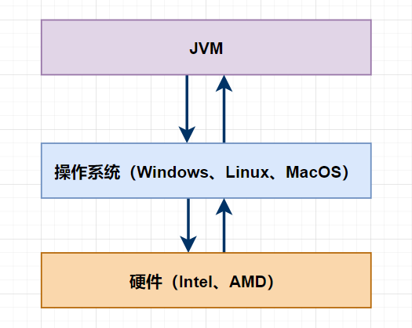
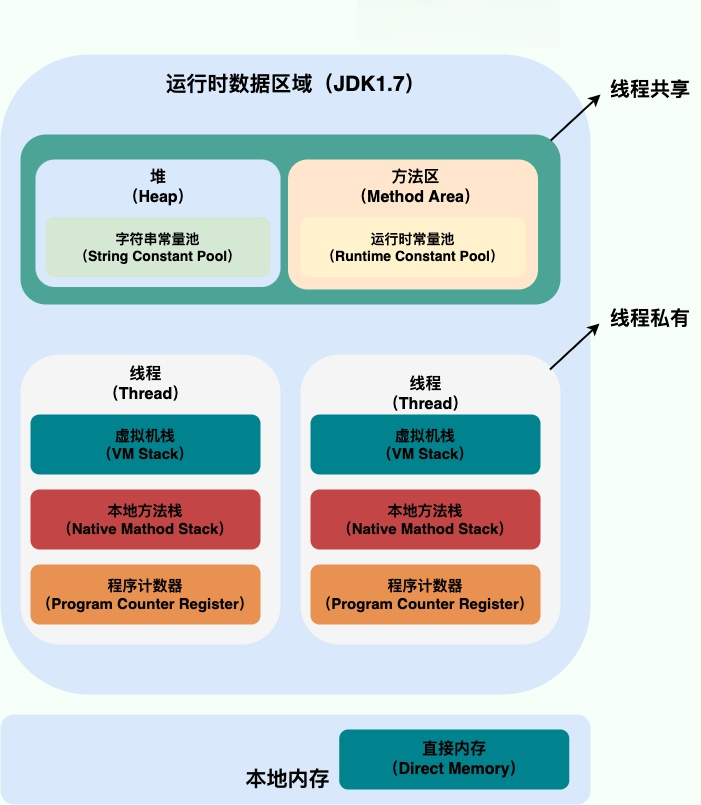
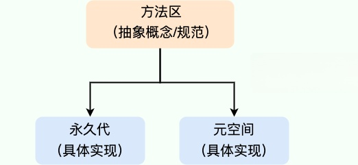
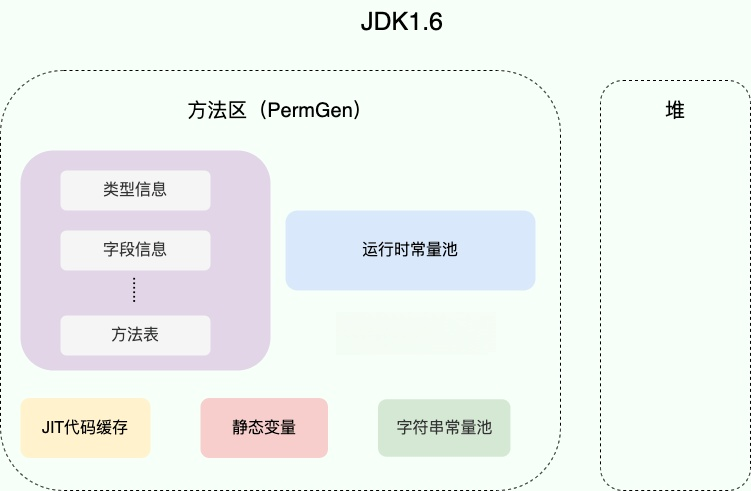
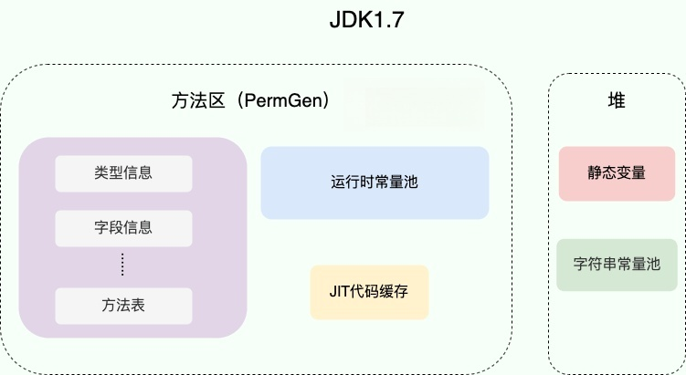

> 主题

1. Java内存结构
2. Java内存设计原则？为什么这么设计
3. Java内存跟计算机内存的相同与不同
4. Java内存结构设计上有什么好与不好的地方

> 文章大纲

1. JVM架构
2. 运行时数据区
3. 直接内存，运行时常量池，字符串常量池
4. jdk不同版本的内存变化
5. 面试tips
   1. 出题，关注回复获取答案

> 参考文章

1. [JVM 基础 - JVM 内存结构](https://pdai.tech/md/java/jvm/java-jvm-struct.html)
2. [Java内存区域详解（重点）](https://javaguide.cn/java/jvm/memory-area.html)
3. [JVM的内存分区/内存结构/内存区域/JVM内存模型](https://www.cnblogs.com/xfeiyun/p/15597663.html)
4. [浅谈JVM整体架构与调优参数](https://developer.huawei.com/consumer/cn/forum/topic/0201147436707418224?fid=0101592429757310384)
5. [【002】十分钟搞懂Java内存结构](https://mp.weixin.qq.com/s?__biz=MzIxNzM0NjA1OQ==&mid=2247483692&idx=1&sn=53ee73807a390cb4b1861e3923407b92&chksm=97fa7848a08df15e4974d5edb963fd1b9209099f10595be6423e1cfcf0e1184ff2fe0b76cbf4&token=1744861076&lang=zh_CN#rd)

> 正文

> 作为一个Java程序员，在日常的开发中，不必像C/C++程序员那样，为每一个内存的分配而操心，JVM会替我们进行自动的内存分配和回收，方便我们开发。但是一旦发生内存泄漏或者内存溢出，如果对Java内存结构不清楚，那将会是一件非常麻烦的事情！本文笔者将为大家详解Java内存结构。

## JVM架构

### JVM的平台无关性

1. 计算机的CPU、内存、显卡等等属于**硬件**
2. 常用的MacOs、Windows、Linux属于计算机的**操作系统**
3. 而Java的虚拟机，也就是**JVM是运行在操作系统**之上的，与硬件没有直接联系，JVM也是Java能够跨平台的根本原因。

### JVM架构

**1. Class Loader 类加载器**

类加载器的作用是**加载类文件到内存**，比如编写一个 HelloWord.java 文件，然后通过 javac 编译成 class 文件，那怎么才能加载到内存中被执行呢？答案就是 Class Loader。当然，不是任何 .class 文件就能被加载的，Class Loader 加载的 class 文件是**有格式要求**。

**2. Execution Engine 执行引擎**

Class Loader 只负责加载，只要符合**文件**结构就加载，至于说能不能**运行**，则不是它负责的，那是由 Execution Engine 负责的。执行引擎也叫做解释器 (Interpreter)，**负责解释命令，提交操作系统执行**。

**3. Native Interface 本地接口**

本地接口的作用是**融合不同的编程语言为 Java 所用**，它的初衷是融合 C/C++ 程序，Java 诞生的时候是 C/C++ 横行的时候，于是就在**内存中专门开辟了一块区域处理标记为 native 的代码**。

**4. Runtime data area 运行时数据区**

运行时数据区是**整个 JVM 的重点**。我们所有写的程序都被加载到这里，之后才开始运行，下面会重点讲解运行时数据区。

### JVM执行流程

当然不同的VM的具体实现细节也不是不一样的，现在使用的比较多的JDK8版本就是**Sun HotSpot VM与BEA JRockit VM**合并之后开发出的JDK版本。

下面就是一个**Java文件加载并执行**的流程

## 运行时数据区

> **运行时数据区是JVM中最为重要的部分。也是我们在调优时需要重点关注的区域。**
>
> 运行时数据区分为：**程序计数器**、**Java虚拟机栈**、**本地方法栈**、**Java堆区**、**方法区**

其中

- **线程私有**：程序计数器、虚拟机栈、本地方法栈
- **线程共享**：堆、方法区, 堆外内存（Java7的永久代或JDK8的元空间、直接内存）

JDK 1.8 和之前的版本略有不同，我们这里以 JDK 1.7 和 JDK 1.8 这两个版本为例介绍。

> **JDK 1.7**：

> **JDK 1.8**：

.png)

### 程序计数器

>  程序计数寄存器（**Program Counter Register**），Register 的命名源于 CPU 的寄存器，寄存器存储指令相关的线程信息，CPU 只有把数据装载到寄存器才能够运行。它是一块很小的内存空间，几乎可以忽略不计。也是运行速度最快的存储区域

1. **JVM 中的 PC 寄存器是对物理 PC 寄存器的一种抽象模拟**。可以看作是当前线程所执行的字节码的**行号指示器**。解释器工作时通过改变这个计数器的值来选取下一条需要执行的字节码指令，分支、循环、跳转、异常处理、线程恢复等功能都需要依赖这个计数器来完成。

2. 由于Java虚拟机的多线程是通过**线程轮流切换**、分配处理器执行时间的方式来实现的，在任何一个确定的时刻，**一个处理器（对于多核处理器来说是一个内核）都只会执行一条线程中的指令**。因此，为了线程切换后能恢复到正确的执行位置，**每条线程都需要有一个独立的程序计数器**。

3. 任何时间一个线程都只有一个方法在执行，也就是所谓的**当前方法**。如果当前线程正在执行的是 Java 方法，程序计数器记录的是 JVM 字节码指令地址，如果是执行 native 方法，则是未指定值（undefined）

4. 程序计数器是唯一一个不会出现 `OutOfMemoryError` 的内存区域，它的生命周期与线程保持一致。

   

### Java虚拟机栈

> 每个线程在创建的时候都会创建一个虚拟机栈，其内部保存一个个的**栈帧(Stack Frame）**，对应着一次次 **Java 方法调用**，是线程私有的，生命周期和线程一致。

**1、栈的内部结构**

每个**栈帧**（Stack Frame）中存储着：

- **局部变量表（Local Variables）**：主要存放了编译期可知的**各种数据类型**（boolean、byte、char、short、int、float、long、double）、对象引用（reference 类型，它不同于对象本身，可能是一个指向对象起始地址的引用指针，也可能是指向一个代表对象的句柄或其他与此对象相关的位置）

- **操作数栈（Operand Stack）**：主要用于存放方法执行过程中产生的**中间计算结果**。另外，计算过程中产生的临时变量也会放在操作数栈中。**如果被调用的方法带有返回值的话，其返回值将会被压入当前栈帧的操作数栈中**。

- **动态链接（Dynamic Linking）**：指向运行时常量池的方法引用。Class 文件的常量池里保存有大量的符号引用比如方法引用的符号引用，当一个方法要调用其他方法，需要将常量池中指向方法的符号引用转化为其在内存地址中的直接引用。这个过程也被称为 **动态连接**

- **方法返回地址（Return Address）**：方法正常退出或异常退出的地址

PS: 局部变量表中的变量也是重要的**垃圾回收根节点**，只要被局部变量表中直接或间接引用的对象都不会被回收

**2、栈的执行流程**

- JVM 直接对虚拟机栈的操作只有两个：方法调用**入栈**，方法执行结束**出栈**。
- 在线程中，同一时间只会有一个活动的栈帧，即（**栈顶栈帧**）是有效的，这个栈帧被称为**当前栈帧**（Current Frame），与当前栈帧对应的方法就是**当前方法**（Current Method），定义这个方法的类就是**当前类**（Current Class）
- 如果在该方法中**调用了其他方法**，对应的**新的栈帧**会被创建出来，放在栈的顶端，称为新的当前栈帧
- 不同线程中所包含的栈帧是不允许相互引用的，即**不可能在一个栈帧中引用另外一个线程的栈帧**

**3、栈的异常**

- **`StackOverFlowError`：** 若栈的内存大小不允许动态扩展，那么当线程请求栈的深度超过当前 Java 虚拟机栈的最大深度的时候，就抛出 `StackOverFlowError` 错误。

- **`OutOfMemoryError`：** 如果栈的内存大小可以动态扩展， 如果虚拟机在动态扩展栈时无法申请到足够的内存空间，则抛出`OutOfMemoryError`异常。

### 本地方法栈

> 本地方法栈和Java虚拟机栈所发挥的作用非常相似

- 二者区别在于： **虚拟机栈为虚拟机执行 Java 方法** （也就是字节码）服务，而**本地方法栈则为虚拟机使用到的 Native 方法服务**。

- 本地方法被执行的时候，在本地方法栈也会创建一个栈帧，用于存放该本地方法的局部变量表、操作数栈、动态链接、出口信息。

- 方法执行完毕后相应的栈帧也会出栈并释放内存空间，也会出现 `StackOverFlowError` 和 `OutOfMemoryError` 两种异常。
- 在 **Hotspot JVM** 中，直接将本地方法栈和虚拟机栈合二为一

### Java堆区

> **栈是运行时的单位，而堆是存储的单位**。
>
> Java 堆是 Java 虚拟机管理的内存中最大的一块，被**所有线程共享**。

此内存区域的唯一目的就是**存放对象实例**，几乎所有的对象实例以及数据都在这里分配内存。**成员变量名和值存储于堆中**，其生命周期和对象的是一致的。

Java 世界中“几乎”所有的对象都在堆中分配，但是，随着 JIT 编译器的发展与逃逸分析技术逐渐成熟，栈上分配、标量替换优化技术将会导致一些微妙的变化，所有的对象都分配到堆上也渐渐变得不那么“绝对”了。从 JDK 1.7 开始已经默认开启逃逸分析，如果某些方法中的对象引用没有被返回或者未被外面使用（也就是未逃逸出去），那么对象可以直接在栈上分配内存。

为了进行高效的垃圾回收，虚拟机把堆内存**逻辑上**划分成三块区域（分代的唯一理由就是优化 GC 性能）：

- **新生带（年轻代）**：新对象和没达到一定年龄的对象都在新生代
- **老年代（养老区）**：被长时间使用的对象，老年代的内存空间应该要比年轻代更大
- **元空间（JDK1.8 之前叫永久代）**：一些方法中的操作临时对象等，JDK1.8 之前是占用 JVM 内存，JDK1.8 之后直接使用物理内存

堆这里最容易出现的就是 `OutOfMemoryError` 错误，比如：

1. **`java.lang.OutOfMemoryError: GC Overhead Limit Exceeded`**：当 JVM 花太多时间执行垃圾回收并且只能回收很少的堆空间时，就会发生此错误。
2. **`java.lang.OutOfMemoryError: Java heap space`** :假如在创建新的对象时, 堆内存中的空间不足以存放新创建的对象, 就会引发此错误。(和配置的最大堆内存有关，且受制于物理内存大小。最大堆内存可通过`-Xmx`参数配置，若没有特别配置，将会使用默认值，详见：[Default Java 8 max heap sizeopen in new window](https://stackoverflow.com/questions/28272923/default-xmxsize-in-java-8-max-heap-size))

PS:**关于Java堆的分代和对象的创建回收，后续我还会专门开一篇文章展开**

### 方法区

> **方法区属于是 JVM 运行时数据区域的一块逻辑区域，是各个线程共享的内存区域**

**方法区和永久代以及元空间是什么关系呢？** 

方法区和永久代以及元空间的关系很像 Java 中接口和类的关系，类实现了接口，这里的类就可以看作是永久代和元空间，接口可以看作是方法区，也就是说永久代以及元空间是 HotSpot 虚拟机对虚拟机规范中方法区的两种实现方式。并且，永久代是 JDK 1.8 之前的方法区实现，JDK 1.8 及以后方法区的实现变成了元空间。

运行时常量池（Runtime Constant Pool）是虚拟机规范中是方法区的一部分，在加载类和结构到虚拟机后，就会创建对应的运行时常量池；而字符串常量池是这个过程中常量字符串的存放位置。所以从这个角度，字符串常量池属于虚拟机规范中的方法区，它是一个**逻辑上的概念**；而堆区，永久代以及元空间是实际的存放位置。

当虚拟机要使用一个类时，它需要读取并解析 Class 文件获取相关信息，再将信息存入到方法区。方法区会存储已被虚拟机加载的 **类信息、字段信息、方法信息、常量、静态变量、即时编译器编译后的代码缓存等数据**。

在加载类和结构到虚拟机后，就会创建对应的运行时常量池

常量池表（Constant Pool Table）是 Class 文件的一部分，用于存储编译期生成的各种字面量和符号引用，**这部分内容将在类加载后存放到方法区的运行时常量池中**

JVM 为每个已加载的类型（类或接口）都维护一个常量池。池中的数据项像数组项一样，是通过索引访问的

方法区在 JDK6、7、8中的演进细节

| JDK版本      | 是否有永久代，字符串常量池放在哪里？                         | 方法区逻辑上规范，由哪些实际的部分实现的？                   |
| ------------ | ------------------------------------------------------------ | ------------------------------------------------------------ |
| jdk1.6及之前 | 有永久代，运行时常量池（包括字符串常量池），静态变量存放在永久代上 | 这个时期方法区在HotSpot中是由永久代来实现的，以至于**这个时期说方法区就是指永久代** |
| jdk1.7       | 有永久代，但已经逐步“去永久代”，字符串常量池、静态变量移除，保存在堆中； | 这个时期方法区在HotSpot中由**永久代**（类型信息、字段、方法、常量）和**堆**（字符串常量池、静态变量）共同实现 |
| jdk1.8及之后 | 取消永久代，类型信息、字段、方法、常量保存在本地内存的元空间，但字符串常量池、静态变量仍在堆中 | 这个时期方法区在HotSpot中由本地内存的**元空间**（类型信息、字段、方法、常量）和**堆**（字符串常量池、静态变量）共同实现 |

