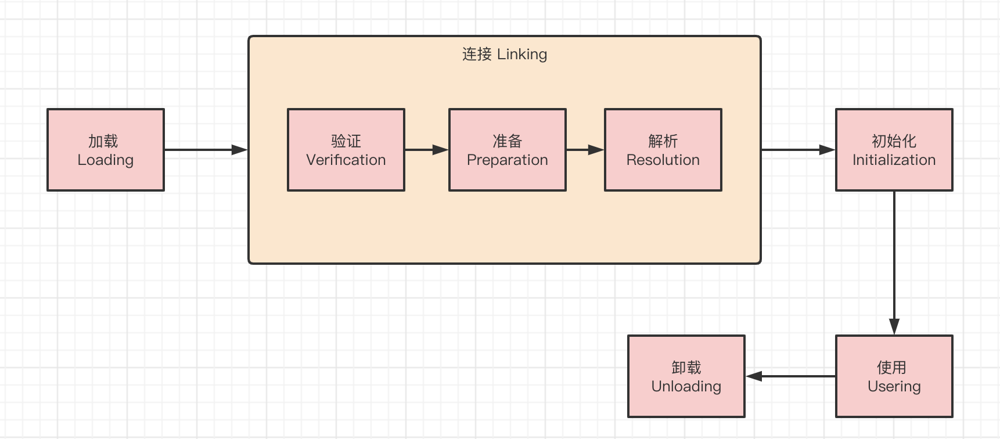
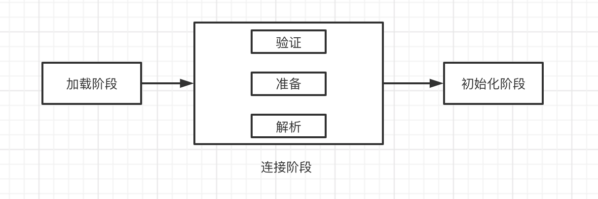
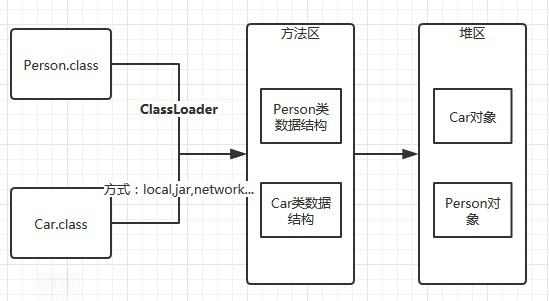

>  主题

面试官：Java文件是如何被加载到内存中的？

面试官：如何构造一个自定义类加载器？

面试官：什么是双亲委派机制？

**Class 文件需要加载到虚拟机中之后才能运行和使用，那么虚拟机是如何加载这些 Class 文件呢？**

> 大纲

类加载过程

双亲委派机制

Java类加载器的分类

自定义类加载器

> 参考内容

[十分钟搞懂Java类加载](https://mp.weixin.qq.com/s?__biz=MzIxNzM0NjA1OQ==&mid=2247483698&idx=1&sn=6ab24416042310b91f9363fff3402370&chksm=97fa7856a08df140e0a97ad31cbfcc3b99d13741e1db365ea08ab307392f3d1b1535f2041fdb&token=471240037&lang=zh_CN#rd)

[Java 类加载机制](https://pdai.tech/md/java/jvm/java-jvm-classload.html)

[类加载过程详解](https://javaguide.cn/java/jvm/class-loading-process.html)

[JVM：类加载过程](https://cloud.tencent.com/developer/article/1787638)

> 正文

## 

## 类的生命周期

一个类从被加载到虚拟机内存开始，到卸载出内存为止，**它的整个生命周期将会经历加载、验证、准备、解析、初始化、使用和卸载七个阶段，其中验证、准备、解析三个部分统称为连接。**

加载、验证、准备、初始化和卸载这五个阶段的顺序是确定的，类型的加载过程必须按照这种顺序按步就班地开始，而解析阶段则不一定：它在某些情况下可以在初始化阶段之后再开始，这是为了支持Java语言的运行时绑定特性。

## 类加载过程

系统加载 Class 类型的文件主要三步：**加载->连接->初始化**。连接过程又可分为三步：**验证->准备->解析**。

## 加载

> 加载是类加载过程的第一个阶段，在加载阶段，虚拟机需要完成以下三件事情

- 通过一个类的全限定名来获取其定义的**二进制字节流**。
- 将这个字节流所代表的静态存储结构转化为**方法区的运行时数据结构**。
- 在**Java堆**中生成一个代表这个**类的java.lang.Class对象**，作为对方法区中这些数据的访问入口。

> 加载.class文件的方式

- 从**本地文件**系统中直接加载
- 通过**网络下载**.class文件
- 从**zip，jar等归档文件**中加载.class文件
- 从专有**数据库**中提取.class文件
- 将**Java源文件**动态编译为.class文件

## 链接

### 验证

> 确保被加载的类的正确性

验证是连接阶段的第一步，这一阶段的目的是为了确保Class文件的字节流中包含的信息符合当前虚拟机的要求，并且不会危害虚拟机自身的安全。

- **文件格式验证**（Class 文件格式检查）
- **元数据验证**（字节码语义检查）
- **字节码验证**（程序语义检查）
- **符号引用验证**（类的正确性检查）

### 准备

> 为类的静态变量分配内存，并将其初始化为默认值

### 解析

> 把类中的符号引用转换为直接引用

## 类的初始化

> 当一个JVM在启动之后，其中可能包含的类非常多，是不是每个类都会被初始化呢？答案是**否定**的。

JVM对类的初始化是一个**延迟机制**，当一个类在首次使用的时候才会被初始化，在同一个运行时package下，一个Class只会被初始化一次。

> 《Java虚拟机规范》则是严格规定了**有且只有6种情况**下必须立即对类进行**初始化**（而加载、验证、准备自然需要在此之前开始）

1. 通过**new关键字**会导致类的初始化

2. 访问**类的静态变量**，包括读取和更新会导致类的初始化

3. 访问**类的静态方法**，也会导致类初始化

4. **初始化子类**会导致父类被初始化

5. 对某个类进行**反射操作**。会导致类被初始化

6. **启动类**，就是执行main函数所在的类会导致该类被初始化

**注意：构造某个类的数组时并不会导致该类的初始化**

