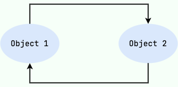
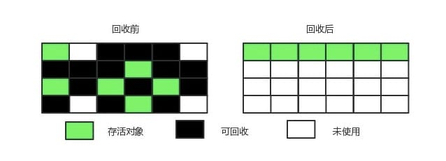

> 标题

面试官：如何判断一个对象是否可以被回收?

> 大纲

如何判断一个对象应该

> 引用

https://mp.weixin.qq.com/s?__biz=MzIxNzM0NjA1OQ==&mid=2247483723&idx=1&sn=5b5e57f842d652732bbab73b61d2d1fd&chksm=97fa782fa08df139857b3ccf8d6a15a20ed401838e40451fb1612ab3a3bf185445d4c8fa50e4&scene=126&sessionid=1720533881#rd

[Java 垃圾回收基础知识](https://pdai.tech/md/java/jvm/java-jvm-gc.html)

[JVM垃圾回收详解（重点）](https://javaguide.cn/java/jvm/jvm-garbage-collection.html)

[JVM之垃圾回收机制（GC）](https://juejin.cn/post/7123853933801373733)

> 正文

## 对象回收判断

### 引用计数算法

「**定义**」

一个对象被创建之后，系统会给这个对象初始化一个引用计数器，当这个对象被引用了，则计数器 +1，而当该引用失效后，计数器便 -1，直到计数器为 0，意味着该对象不再被使用了，则可以将其进行回收了。

「**存在问题**」

两个对象出现循环引用的情况下，此时引用计数器永远不为 0，导致无法对它们进行回收。

### 可达性分析算法

「**定义**」

以 GC Roots 作为起始点进行搜索，一步步遍历找到和这个根对象具有引用关系的对象，然后再从这些对象开始继续寻找，能够到达到的对象都是存活的，不可达的对象可被回收。

在 Java 中 GC Roots 一般包含以下内容:

- **虚拟机栈**中引用的对象
- **本地方法栈**中引用的对象
- 方法区中**类静态属性**引用的对象
- 方法区中的**常量引用**的对象

- 

### finalize()

> **对象可以被回收，就代表一定会被回收吗**？

即使在可达性分析法中不可达的对象，也并不是立刻回收。宣告一个对象死亡，至少要经历**两次标记**

「**第一次标记**」

如果对象进行可达性分析算法之后发现未与 GC Roots 引用链相连，那它将会第一次标记并且进行一次筛选。当对象**没有覆盖 finalize () 方法**、或者 **finalize () 方法已经被 JVM 执行过**，则判定为**可回收对象**。如果对象有必要执行 finalize () 方法，则被放入 **F-Queue 队列**中。稍后在 JVM 自动建立、低优先级的 Finalizer 线程（可能多个线程）中触发这个方法.

「**第二次标记**」

GC 对 F-Queue 队列中的对象进行二次标记。如果对象在 finalize () 方法中**重新与引用链上的任何一个对象建立了关联**，那么二次标记时则会将它移出 “即将回收” 集合。如果此时对象还没成功逃脱，那么只能被回收了。

**注意 ⚠️**：JDK9 版本及后续版本中各个类中的 `finalize` 方法会被逐渐弃用移除。忘掉它的存在吧！

## 类回收判断

> 在大量使用反射、动态代理、CGLib 等 ByteCode 框架、动态生成 JSP 以及 OSGi 这类频繁**自定义 ClassLoader** 的场景都需要虚拟机具备**类卸载**功能，以保证不会出现内存溢出。

JVM方法区存储的是类信息，因此主要针对**方法区**进行类回收，那么如何判断一个类是**无用的类**的呢？

类需要同时满足下面 3 个条件才能算是 **“无用的类”**：

- 该类**所有的实例**都已经被回收，也就是 Java 堆中不存在该类的任何实例。
- 加载该类的 `ClassLoader` 已经被回收。
- 该类对应的 `java.lang.Class` 对象没有在任何地方被引用，无法在任何地方通过反射访问该类的方法。

虚拟机可以对满足上述 3 个条件的无用类进行回收，这里说的仅仅是“**可以**”，而并**不是和对象一样不使用就会必然被回收**。

## 垃圾回收算法

### 标记-清除

> 将存活的对象进行标记，然后清理掉未被标记的对象。

这是一个非常基本的GC算法，它是现代GC算法的思想基础，分为**标记和清除**两个阶段：先把所有活动的**对象标记（可达性分析法）**出来，然后把没有被标记的对象**统一清除掉**。

「**不足**」

- 标记和清除过程效率都不高；
- 会产生大量不连续的内存碎片，导致无法给大对象分配内存。

### 标记-整理

> 让所有存活的对象都向一端移动，然后直接清理掉端边界以外的内存。

标记—整理算法适用于**存活对象较多**的场合，它的标记阶段和标记-清除算法中的一样。整理阶段是将所有存活的对象压缩到**内存的一端**，之后**清理边界外所有的空间**。它的效率也不高。

### 复制

> 将内存划分为大小相等的两块，每次只**使用其中一块**，当这一块内存用完了就将还存活的对象**复制到另一块**上面，然后再把使用过的内存空间进行一次清理。

它比标记-清除算法要**高效**，但不适用于**存活对象较多**的内存，因为复制的时候会有较多的时间消耗。它的致命缺点是会有**一半的内存浪费**。

主要不足是只使用了内存的一半。

现在的商业虚拟机都采用这种收集算法来回收新生代，但是并不是将新生代划分为大小相等的两块，而是分为一块较大的 Eden 空间和两块较小的 Survivor 空间，每次使用 Eden 空间和其中一块 Survivor。在回收时，将 Eden 和 Survivor 中还存活着的对象一次性复制到另一块 Survivor 空间上，最后清理 Eden 和使用过的那一块 Survivor。

HotSpot 虚拟机的 Eden 和 Survivor 的大小比例默认为 8:1，保证了内存的利用率达到 90%。如果每次回收有多于 10% 的对象存活，那么一块 Survivor 空间就不够用了，此时需要依赖于老年代进行分配担保，也就是借用老年代的空间存储放不下的对象。

## 内存分配与回收策略

现在的商业虚拟机采用分代收集算法，它根据对象存活周期将内存划分为几块，不同块采用适当的收集算法。

一般将堆分为新生代和老年代。

- 新生代使用: 复制算法
- 老年代使用: 标记 - 清除 或者 标记 - 整理 算法

