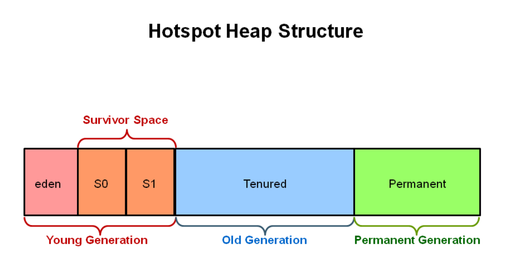

> 标题

面试官：如何判断一个对象是否可以被回收?

> 大纲

如何判断一个对象应该

> 引用

https://mp.weixin.qq.com/s?__biz=MzIxNzM0NjA1OQ==&mid=2247483723&idx=1&sn=5b5e57f842d652732bbab73b61d2d1fd&chksm=97fa782fa08df139857b3ccf8d6a15a20ed401838e40451fb1612ab3a3bf185445d4c8fa50e4&scene=126&sessionid=1720533881#rd

[Java 垃圾回收基础知识](https://pdai.tech/md/java/jvm/java-jvm-gc.html)

[JVM垃圾回收详解（重点）](https://javaguide.cn/java/jvm/jvm-garbage-collection.html)

[JVM之垃圾回收机制（GC）](https://juejin.cn/post/7123853933801373733)

> 正文

## 1. 对象回收判断

### 1.1 引用计数算法

「**定义**」

一个对象被创建之后，系统会给这个对象初始化一个引用计数器，当这个对象被引用了，则计数器 +1，而当该引用失效后，计数器便 -1，直到计数器为 0，意味着该对象不再被使用了，则可以将其进行回收了。

「**存在问题**」

两个对象出现循环引用的情况下，此时引用计数器永远不为 0，导致无法对它们进行回收。

### 1.2 可达性分析算法

「**定义**」

以 GC Roots 作为起始点进行搜索，一步步遍历找到和这个根对象具有引用关系的对象，然后再从这些对象开始继续寻找，能够到达到的对象都是存活的，不可达的对象可被回收。

在 Java 中 GC Roots 一般包含以下内容:

- **虚拟机栈**中引用的对象
- **本地方法栈**中引用的对象
- 方法区中**类静态属性**引用的对象
- 方法区中的**常量引用**的对象

- 

### 1.3 finalize()

> **对象可以被回收，就代表一定会被回收吗**？

即使在可达性分析法中不可达的对象，也并不是立刻回收。宣告一个对象死亡，至少要经历**两次标记**

「**第一次标记**」

如果对象进行可达性分析算法之后发现未与 GC Roots 引用链相连，那它将会第一次标记并且进行一次筛选。当对象**没有覆盖 finalize () 方法**、或者 **finalize () 方法已经被 JVM 执行过**，则判定为**可回收对象**。如果对象有必要执行 finalize () 方法，则被放入 **F-Queue 队列**中。稍后在 JVM 自动建立、低优先级的 Finalizer 线程（可能多个线程）中触发这个方法.

「**第二次标记**」

GC 对 F-Queue 队列中的对象进行二次标记。如果对象在 finalize () 方法中**重新与引用链上的任何一个对象建立了关联**，那么二次标记时则会将它移出 “即将回收” 集合。如果此时对象还没成功逃脱，那么只能被回收了。

**注意 ⚠️**：JDK9 版本及后续版本中各个类中的 `finalize` 方法会被逐渐弃用移除。忘掉它的存在吧！

## 2. 类回收判断

> 在大量使用反射、动态代理、CGLib 等 ByteCode 框架、动态生成 JSP 以及 OSGi 这类频繁**自定义 ClassLoader** 的场景都需要虚拟机具备**类卸载**功能，以保证不会出现内存溢出。

JVM方法区存储的是类信息，因此主要针对**方法区**进行类回收，那么如何判断一个类是**无用的类**的呢？

类需要同时满足下面 3 个条件才能算是 **“无用的类”**：

- 该类**所有的实例**都已经被回收，也就是 Java 堆中不存在该类的任何实例。
- 加载该类的 `ClassLoader` 已经被回收。
- 该类对应的 `java.lang.Class` 对象没有在任何地方被引用，无法在任何地方通过反射访问该类的方法。

虚拟机可以对满足上述 3 个条件的无用类进行回收，这里说的仅仅是“**可以**”，而并**不是和对象一样不使用就会必然被回收**。

## 3. 垃圾回收算法

### 3.1 标记-清除

> 将存活的对象进行标记，然后清理掉未被标记的对象。

这是一个非常基本的GC算法，它是现代GC算法的思想基础，分为**标记和清除**两个阶段：先把所有活动的**对象标记（可达性分析法）**出来，然后把没有被标记的对象**统一清除掉**。

「**不足**」

- 标记和清除过程效率都不高；
- 会产生大量不连续的内存碎片，导致无法给大对象分配内存。

### 3.2 标记-整理

> 让所有存活的对象都向一端移动，然后直接清理掉端边界以外的内存。

标记—整理算法适用于**存活对象较多**的场合，它的标记阶段和标记-清除算法中的一样。整理阶段是将所有存活的对象压缩到**内存的一端**，之后**清理边界外所有的空间**。它的效率也不高。

### 3.3 复制

> 将内存划分为大小相等的两块，每次只**使用其中一块**，当这一块内存用完了就将还存活的对象**复制到另一块**上面，然后再把使用过的内存空间进行一次清理。

它比标记-清除算法要**高效**，但不适用于**存活对象较多**的内存，因为复制的时候会有较多的时间消耗。它的致命缺点是会有**一半的内存浪费**。

主要不足是只使用了内存的一半。

### 3.4 分代收集

现在的商业虚拟机采用分代收集算法，它根据对象存活周期将内存划分为几块，不同块采用适当的收集算法。

一般将堆分为新生代和老年代。

- 新生代使用: 复制算法
- 老年代使用: 标记-清除 或者 标记-整理 算法

『**新生代（Young Generation）**』

> 所有新生成的对象首先都是放在新生代的。新生代的目标就是尽可能快速的收集掉那些生命周期短的对象。

- 新生代内存分配一块**较大的 Eden 空间和两块较小的 Survivor** 空间（默认 Eden 和 Survivor 的大小比例是 **8:1**）。每次使用 Eden 和其中一块 Survivor 空间（**当Eden内存满了就会把对象分配到Survivor区**）
- 回收时将 `Eden` 和 `Survivor` 空间中**存活的对象**一次性复制到另一块 Survivor 空间上。最后清理掉 Eden 和使用过的 Survivor 空间。Survivor 区总有一个是空的。
- 如果另一块 `Survivor` 空间没有足够内存来存放上一次新生代收集下来的存活对象，那么这些对象则直接进入老年代。
- 新生代发生的GC也叫做`Minor GC`，MinorGC发生频率比较高(不一定等Eden区满了才触发)。
- 若是老年代也满了就会触发一次`Full GC`，也就是新生代、老年代都进行回收。

『**老年代（Old Generation）**』

- 在新生代中经历了 N 次垃圾回收后仍然存活的对象，就会被放到老年代中。因此，可以认为**老年代中存放的都是一些生命周期较长的对象**。
- 内存比新生代也大很多(大概比例是1:2)，当老年代内存满时触发`Full GC`，`Full GC`发生频率比较低，老年代对象存活时间比较长，存活率标记高

**注意 ⚠️**：大对象直接进入老年代

## 4. Minor GC、Major GC、Full GC

针对 HotSpot VM 的实现，它里面的 GC 按照回收区域又分为两大类：部分收集（Partial GC），整堆收集（Full GC）

- 新生代收集（Minor GC/Young GC）：只是新生代的垃圾收集
- 老年代收集（Major GC/Old GC）：只是老年代的垃圾收集 
  - 目前，只有 CMS GC 会有单独收集老年代的行为
  - 很多时候 Major GC 会和 Full GC 混合使用，需要具体分辨是老年代回收还是整堆回收
- 混合收集（Mixed GC）：收集整个新生代以及部分老年代的垃圾收集 
  - 目前只有 G1 GC 会有这种行为

- 整堆收集（Full GC）：收集整个 Java 堆和方法区的垃圾

full gc触发条件
1. 调用 System.gc()
2. 老年代空间不足
3. 空间分配担保失败
4. JDK 1.7 及以前的永久代空间不足

## 5. 内存分配策略

1.对象优先在 Eden 分配

大多数情况下，对象在新生代 Eden 区分配，当 Eden 区空间不够时，发起 Minor GC。

2.大对象直接进入老年代

大对象是指需要连续内存空间的对象，最典型的大对象是那种很长的字符串以及数组。

经常出现大对象会提前触发垃圾收集以获取足够的连续空间分配给大对象。

-XX:PretenureSizeThreshold，大于此值的对象直接在老年代分配，避免在 Eden 区和 Survivor 区之间的大量内存复制。

3.长期存活的对象进入老年代

为对象定义年龄计数器，对象在 Eden 出生并经过 Minor GC 依然存活，将移动到 Survivor 中，年龄就增加 1 岁，增加到一定年龄则移动到老年代中。

-XX:MaxTenuringThreshold 用来定义年龄的阈值。

4.动态对象年龄判定

虚拟机并不是永远地要求对象的年龄必须达到 MaxTenuringThreshold 才能晋升老年代，如果在 Survivor 中相同年龄所有对象大小的总和大于 Survivor 空间的一半，则年龄大于或等于该年龄的对象可以直接进入老年代，无需等到 MaxTenuringThreshold 中要求的年龄。

5.空间分配担保

在发生 Minor GC 之前，虚拟机先检查老年代最大可用的连续空间是否大于新生代所有对象总空间，如果条件成立的话，那么 Minor GC 可以确认是安全的。
